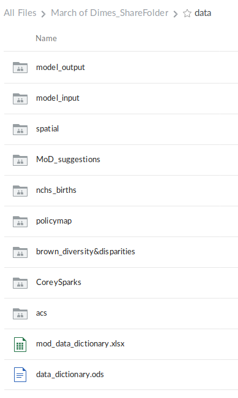

```{r knitr_init, echo=FALSE, results="asis", cache=FALSE}
library(knitr)
library(rmdformats)
library(DT)
## Global options
options(max.print = "75")
opts_chunk$set(echo = FALSE,
	             cache = FALSE,
               prompt = FALSE,
               tidy = FALSE,
               comment = NA,
               message = FALSE,
               warning = FALSE)
opts_knit$set(width = 75)
```

# Model architecture overview

This README document outlines the March of Dimes (MoD) 'Mapping the Social Epidemiology of Preterm Birth' model architecture. It is meant to be a reference and a guide for anyone who would like to run the model on their own. 

This model requires two primary file folder structures: data and code. Setting each up is outlined below

# Running the model

## Setting up environment

### Data

Your local data folder structure should reflect that which is currently on the Box 'March of Dimes_ShareFolder', seen below:




### Code

Your local code repo should be a forked copy of Michael Kramer's [mod_geodisparities](https://github.com/mkram01/mod-geodisparities) repo.

Once forked and cloned locally, your repo should look like this:


If you are new to Git or the Fork-and-Branch workflow, I recommend the following resources:

+ [A good introduction](https://blog.scottlowe.org/2015/01/14/non-programmer-git-intro/)
+ [Using Git with GitHub](https://blog.scottlowe.org/2015/01/26/using-git-with-github/)
+ [Fork-and-Branch flow](https://blog.scottlowe.org/2015/01/27/using-fork-branch-git-workflow/)
+ [Git cheatsheet](https://education.github.com/git-cheat-sheet-education.pdf)
+ [Happy Git and GitHub for the useR](https://happygitwithr.com/index.html)

### Global environment variables

Environment variables help make code more dynamic and eliminates dependencies on hard-coding things like file paths. Feel free to set these however you please, [here](https://astrostatistics.psu.edu/su07/R/html/base/html/Sys.setenv.html) is a solution for setting them from the R console.

This model relies on 3 global environment variables that need to be set in your working environment:

1.  `mod_repo`: the path to the MoD code repo in your working environment
      + **Example:** */home/e/Documents/git_repos/mod-geodisparities/*
      + Called at start of model: `repo <- Sys.getenv('mod_repo')`
2.  `mod_data`: the path to the MoD data in your working environment
      + **Example:** */home/e/MoD/data*
      + Called at start of model: `data_repo <- Sys.getenv('mod_data')`
3.  `mod_modeler`: the character value representing you, the modeler. This is used when writing the model run report.
      + **Example:** *"Erin"*
      + Called at start of model: `modeler <- Sys.getenv('mod_modeler)`
  
### Packages

Any packages not currently in your library will automatically be installed and called.

## Config

The config file contains the parameters controlling the dynamic components of the model.

The config file lives in your data repo here:


An example of how your config file might look:


To fill in your arguments, please refer to the config_README.xlsx document in the same folder as the csv.

## Launch

After you have altered arguments in the config file, the launch file should be the only other component you need to interact with and is all you need to open to run the model. Simply open `launch.R` and run all.

## Outputs

The name and location of your model outputs are dynamically created from your config arguments and from a time stamp. 

The output hierarchy is as follows and is pictured below: model_type -> family -> outcome -> geography


The model name is a concatenation of the following config arguments:

  + year_start
  + year_end
  + random_slope
  + random_intercept
  + run date
  
Outputs currently include:

  + Model report (.html)
  + Timed summary of how long each component took to run ('..._run_summary.csv')


# About the data & scripts

### Important details about the data being used & created:
  + Currently, the base county geospatial data is from 2016. This layer is being used to create the spatial weights and for visualization.
      + To change this as the baselayer for creating spatial weights, you can define the `baselayer` arg in the `create_adjmatrix` function (located: `data_prep/data_prep_fxns.R`) called in the `precreate_adjmatrices.R` script
      + To change this as the baselayer for visualization, you can define the `baselayer` arge in the `load_spatialdata` function (located: `data_prep/data_prep_fxns.R`) called in the `load_data.R` script
      
  + FIPS matching issues


## Data prep scripts


### precreate_adjmatrices.R

Currently, spatial weights (term used interchangeably here with adjacency matrices) are pre-created using the `precreate_adjmatrices.R` script inside the data_prep folder. The spatial weighting method used thus far is K-nearest neighbors (KNN) and thus code currently only exists to support that. There is a corresponding config arg, `sp_weights_method` that is used to find the proper adjacency matrix file, so be sure to be consistent with this.

If you want to use a different spatial weighting method, you will need to do the following:

  1.  Define a value to indicate that method (e.g `knn` = K-nearest neighbors)
  2.  Add this value as an option in the config_README as well as any additional details necessary for other to understand the method.
  3.  Write the code to calculate the spatial weights using that method in `data_prep/data_prep_fxns.R` in the `create_adjmatrix` function.
  4.  Create any additional config args or code to accomodate further specification
  5.  Update this README section accordingly

## Model prep scripts

## Data load scripts

## Model run scripts

## Model visualization scripts

# Development pipeline

  + Setting all defaults in `model_prep/load_config.R` -- currently, if you do not fill out all fields, there will be issues running the code

# Areas for improvement


